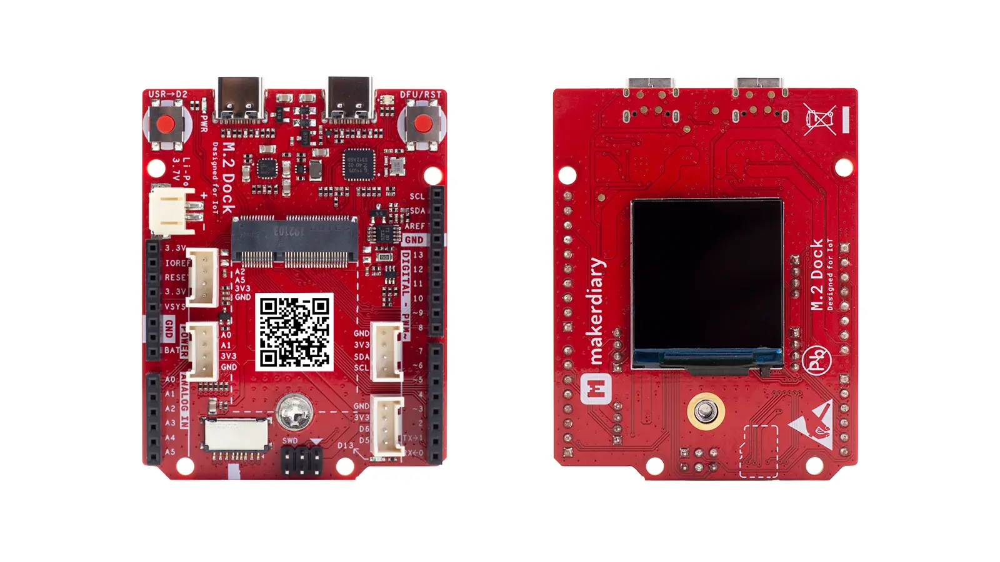
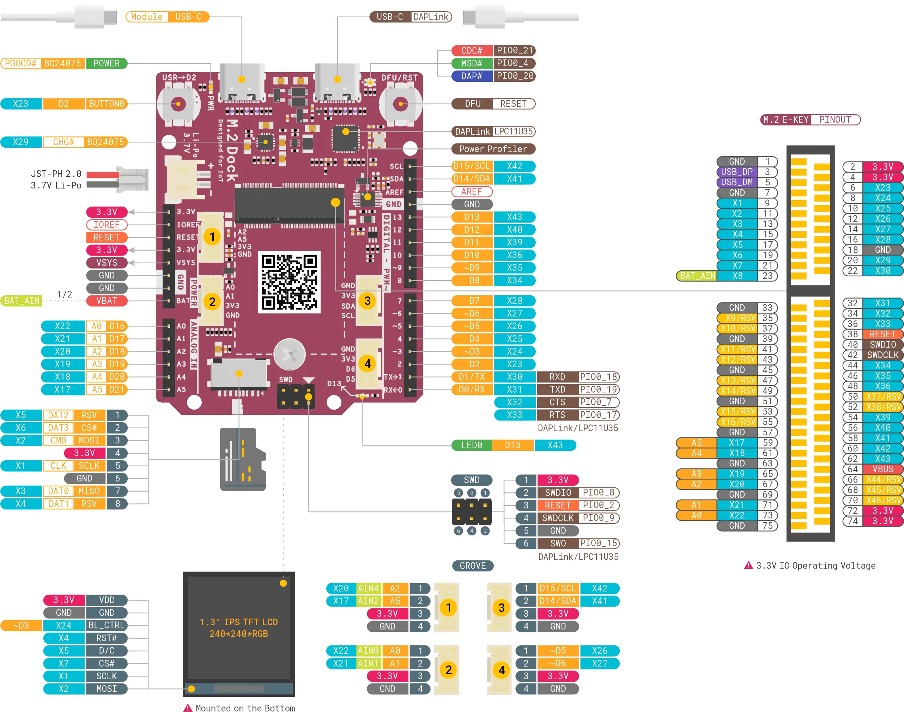

# M.2 Dock

> An essential carrier board to quickly prototype your next embedded design with a removable M.2 module

## Description

The M.2 Dock is an essential carrier board to quickly prototype your next embedded design with a removable M.2 module. It features a fully-integrated [DAPLink](https://armmbed.github.io/DAPLink/) debugger with [Power Profiling](https://wiki.makerdiary.com/m2-dock/power-profiling), enabling you to program, debug and perform real-time current profiling of your IoT applications without using external tools.

This design extends the interfaces compared to the M.2 Module through an M.2 E-Key connector, including USB 2.0 ports, UART, SPI, TWI, PDM, I2S, PWM, ADC and GPIOs.

The M.2 Dock also comes with 1.3" 240x240 Color IPS TFT LCD, Li-Po Battery Charger, microSD Card Slot, Grove Connectors, LEDs and Buttons.

## Key Features

* Integrated DAPLink Debugger
	- MSC - drag-n-drop programming flash memory
	- CDC - virtual com port for log, trace and terminal emulation
	- HID/WEBUSB HID - CMSIS-DAP compliant debug channel

* Advanced Power Profiling
	- Up to 690 mA current measurement
	- Voltage tracking
	- 30000 samples per second
	- Precision amplifiers with dual gain stage
	- Cross-platform utility available in Python

* M.2 E-Key connector
* 1.3" 240x240 Color IPS TFT LCD Display
* Li-Po Battery Charger with Power Path Management
* User programmable LED and Button
* microSD Card Slot
* 4 Grove Connectors
* Reversible USB-C Connectors
* Arduino Form Factor
* 3.3V IO Operationg Voltage

## Hardware Diagram

The hardware diagram of the M.2 Dock is shown below:

## Supported Modules

The following shows the M.2 module that can work with M.2 Dock. More modules are planned and will show up gradually over time.

* [nRF52840 M.2 Module](https://store.makerdiary.com/products/nrf52840-m2-module)

## Tutorials

We think the best way to learn is by doing. And to help you get started, we have provided a series of tutorials. Find the details below:

* [Getting Started with M.2 Dock](https://wiki.makerdiary.com/m2-dock/getting-started)
* [Getting Started with Power Profiling](https://wiki.makerdiary.com/m2-dock/power-profiling)
* [Debugging with pyOCD](https://wiki.makerdiary.com/m2-dock/debugging/pyocd)
* [Debugging with Visual Studio Code](https://wiki.makerdiary.com/m2-dock/debugging/vscode)
* [Debugging with Eclipse](https://wiki.makerdiary.com/m2-dock/debugging/eclipse)
* [Debugging with Keil MDK](https://wiki.makerdiary.com/m2-dock/debugging/keil-mdk)
* [Debugging with IAR Workbench](https://wiki.makerdiary.com/m2-dock/debugging/iar-ewarm)
* [Upgrading the DAPLink Firmware](https://wiki.makerdiary.com/m2-dock/upgrading)

We also offer the **[nRF52840 M.2 Developer Kit](https://store.makerdiary.com/products/nrf52840-m2-developer-kit)** to help you prototype your application and then scale to production faster using the nRF52840 M.2 Module combined with your custom PCB hardware.

## Design Resource

|    **Title**                | **Version** |
| --------------------------- | ----------- |
| [M.2 Dock Hardware Diagram](https://wiki.makerdiary.com/m2-dock/resources/m2_dock_hw_diagram_v1_0.pdf) | V1.0 |
| [M.2 Dock Schematic for nRF52840 M.2 Module](https://wiki.makerdiary.com/m2-dock/resources/m2_dock_schematic_v1_0_for_nrf52840.pdf) | V1.0 |
| [M.2 Dock Board File](https://wiki.makerdiary.com/m2-dock/resources/m2_dock_board_file_v1_0.pdf) | V1.0 |
[M.2 Dock 3D Model](https://wiki.makerdiary.com/m2-dock/resources/m2_dock_3d_model_v1_0.step) | V1.0 |

## Contributing

We would love for you to contribute to this project and help make it even better than it is today! See our [Contributing Guidelines](https://wiki.makerdiary.com/m2-dock/CONTRIBUTING) for more information.

## MIT License

Copyright (c) 2020 [makerdiary](https://makerdiary.com)

Permission is hereby granted, free of charge, to any person obtaining a copy
of this software and associated documentation files (the "Software"), to deal
in the Software without restriction, including without limitation the rights
to use, copy, modify, merge, publish, distribute, sublicense, and/or sell
copies of the Software, and to permit persons to whom the Software is
furnished to do so, subject to the following conditions:

The above copyright notice and this permission notice shall be included in all
copies or substantial portions of the Software.

THE SOFTWARE IS PROVIDED "AS IS", WITHOUT WARRANTY OF ANY KIND, EXPRESS OR
IMPLIED, INCLUDING BUT NOT LIMITED TO THE WARRANTIES OF MERCHANTABILITY,
FITNESS FOR A PARTICULAR PURPOSE AND NONINFRINGEMENT. IN NO EVENT SHALL THE
AUTHORS OR COPYRIGHT HOLDERS BE LIABLE FOR ANY CLAIM, DAMAGES OR OTHER
LIABILITY, WHETHER IN AN ACTION OF CONTRACT, TORT OR OTHERWISE, ARISING FROM,
OUT OF OR IN CONNECTION WITH THE SOFTWARE OR THE USE OR OTHER DEALINGS IN THE
SOFTWARE.