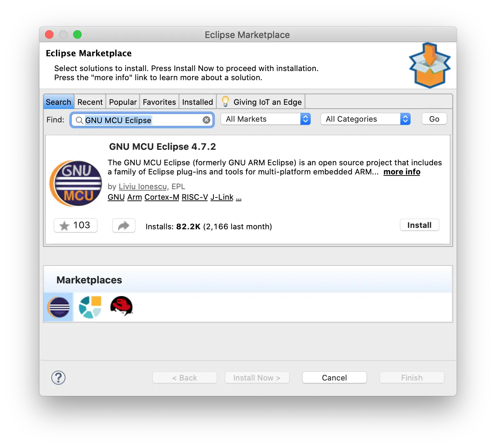
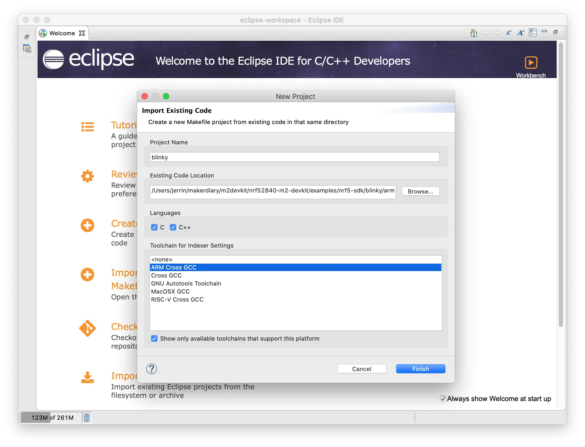
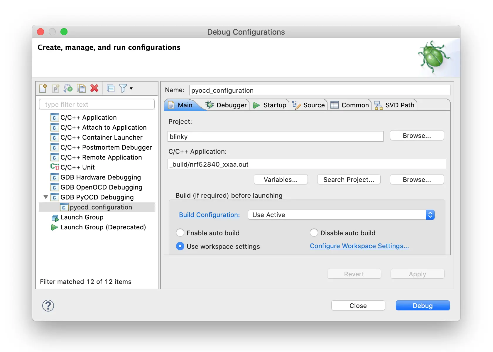
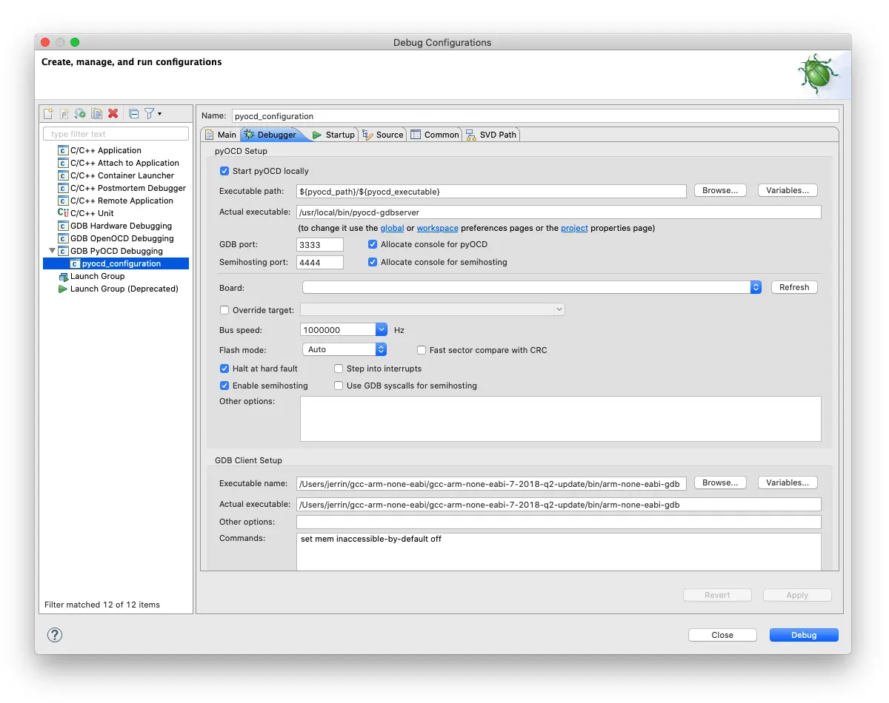
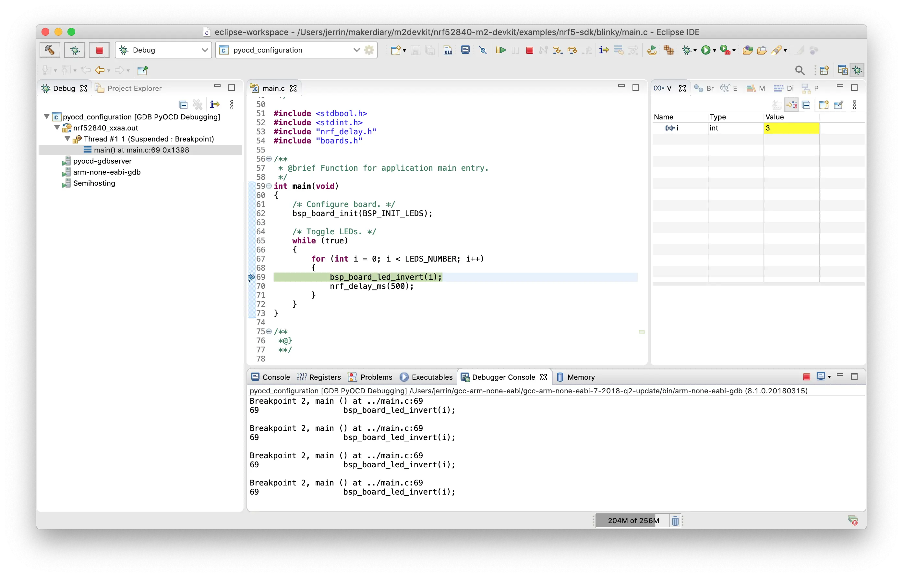

# Debugging with GNU MCU Eclipse

## Introduction

GNU MCU Eclipse fully supports pyOCD with an included pyOCD debugging plugin. This guide explains how to configure the local debug toolchain using M.2 Dock with GNU MCU Eclipse.

## What you'll need

* A [nRF52840 M.2 Developer Kit](https://store.makerdiary.com/products/nrf52840-m2-developer-kit) (including nRF52840 M.2 Module and M.2 Dock)
* A macOS, Linux or Windows computer

## Installing Eclipse

You need to install Eclipse CDT with the GNU MCU Eclipse plugins to begin:

1. Install [Eclipse IDE for C/C++ Developers](http://www.eclipse.org/downloads/eclipse-packages/).
2. Open Eclipse.
3. Create a workspace directory. This will be separate from your code.
4. Install the GNU MCU Eclipse plugin:
	1. Click the **Help** menu item and select **Eclipse Marketplace…**
	2. Find **GNU MCU Eclipse** and install.
	3. Select **GNU MCU Eclipse x.x.x** and confirm.



## Install pyOCD

The latest stable version of pyOCD may be installed via [pip](https://pip.pypa.io/en/stable/index.html) as follows. **Skip** this step if pyOCD already exists.

``` sh
pip install -U pyocd
```

## Install GNU Arm Embedded Toolchain

Download and install the [GNU ARM Embedded Toolchain](https://developer.arm.com/open-source/gnu-toolchain/gnu-rm/downloads). **Skip** this step if the toolchain already exists.

## Importing the project in Eclipse

1. Open Eclipse.
2. On the *Welcome window*, select *Import a project with a working Makefile*.
3. Select the folder to your project with a Makefile. E.g., [blinky/armgcc](https://github.com/makerdiary/nrf52840-m2-devkit/tree/master/examples/nrf5-sdk/blinky/armgcc).
4. Under *Toolchain for Indexer Settings*, select `Cross ARM GCC`.
5. Click *Finish*.



## Configuring the debugger

1. Select *Run* > *Debug Configurations...*.
2. If no configuration exists under *GDB pyOCD Debugging*, click on *New launch configuration*.
3. In the *Main* tab, select the `.out` file (`_build/nrf52840_xxaa.out`) under *C/C++ Application*.
	
	

4. In the *Debugger* tab:
	1. Under *pyOCD Setup*, set the *Executable* path and make sure that it is pointing to your latest version of the `pyocd-gdbserver`.
	2. Under *GDB Client Setup*, set the *Executable* path to your `arm-none-eabi-gdb`.
	3. Click *Apply*.

	[](assets/images/eclipse-debug-configuration_debugger.webp)

!!! tip
	The `which`(on macOS/Linux) or `where`(on Windows) shell command can be used to find the location of `pyocd-gdbserver` and `arm-none-eabi-gdb`. E.g., `which pyocd-gdbserver` and `which arm-none-eabi-gdb`.

## Connecting the target

1. Mount the nRF52840 M.2 Module
2. Connect the **Debugger USB port** of M.2 Dock to your PC using the provided USB-C Cable
3. A disk drive called **M2-DOCK** will be automatically detected by the computer.


## Debugging your project

Click the menu <kbd>Run</kbd> -> <kbd>Debug</kbd>, and debugging starts. Click on the <kbd>Debugger Console</kbd> tab to see the debug output:

[](assets/images/eclipse-debugging.webp)

## Create an Issue

Interested in contributing to this project? Want to report a bug? Feel free to click here:

<a href="https://github.com/makerdiary/m2-dock/issues/new?title=Eclipse%20Debugging:%20%3Ctitle%3E"><button class="md-tile md-tile--primary"><svg xmlns="http://www.w3.org/2000/svg" viewBox="0 0 14 16" width="14" height="16"><path fill-rule="evenodd" d="M7 2.3c3.14 0 5.7 2.56 5.7 5.7s-2.56 5.7-5.7 5.7A5.71 5.71 0 011.3 8c0-3.14 2.56-5.7 5.7-5.7zM7 1C3.14 1 0 4.14 0 8s3.14 7 7 7 7-3.14 7-7-3.14-7-7-7zm1 3H6v5h2V4zm0 6H6v2h2v-2z"></path></svg> Create an Issue</button></a>