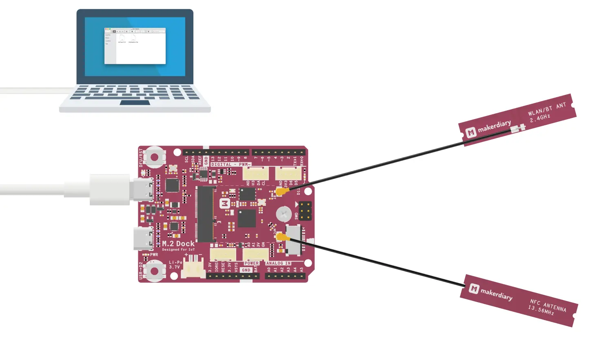
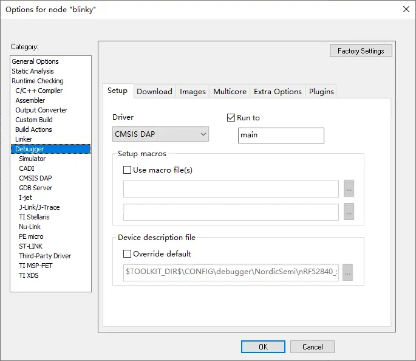
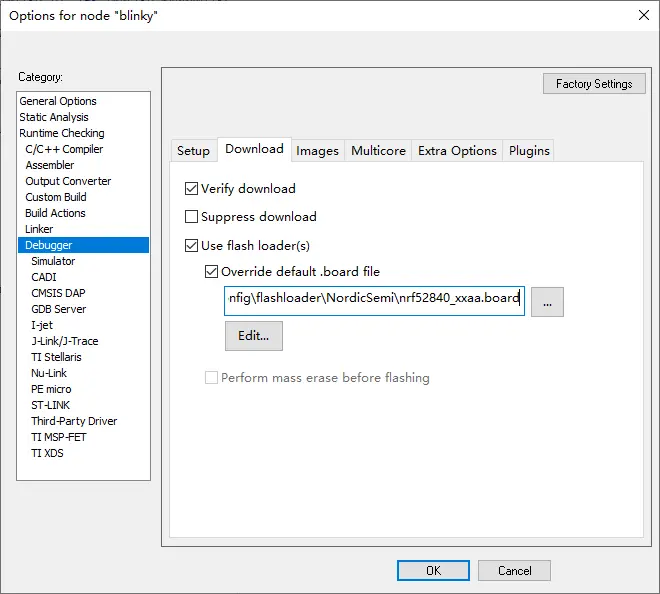
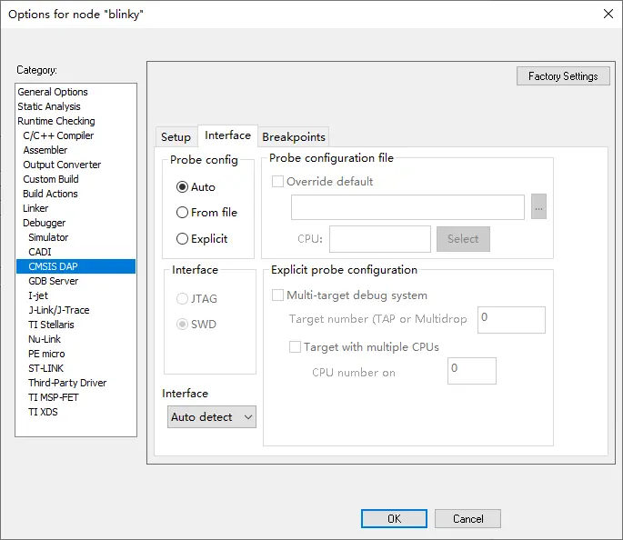
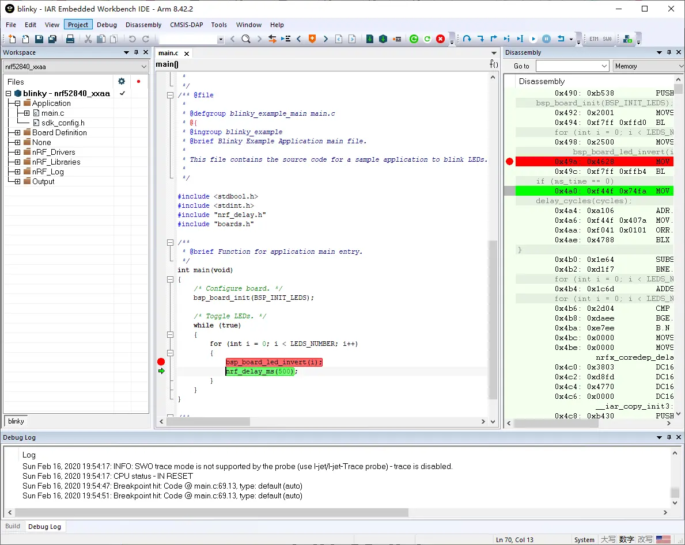

# Debugging with IAR Embedded Workbench

## Introduction

[IAR's EWARM](https://www.iar.com/iar-embedded-workbench/#!?architecture=Arm) is a completely integrated development environment that supports CMSIS-DAP out-of-the-box.

This guide explains how to configure the local debug toolchain using M.2 Dock with IAR's EWARM.

## What you'll need

* A [nRF52840 M.2 Developer Kit](https://store.makerdiary.com/products/nrf52840-m2-developer-kit) (including nRF52840 M.2 Module and M.2 Dock)
* [IAR Embedded Workbench for ARM](https://www.iar.com/iar-embedded-workbench/#!?architecture=Arm)

## Connecting the target

1. Mount the nRF52840 M.2 Module
2. Connect the **Debugger USB port** of M.2 Dock to your PC using the provided USB-C Cable
3. A disk drive called **M2-DOCK** will be automatically detected by the computer.

## Configuring the debugger

1. Open your IAR project.
2. Click *Options* from the *Project* menu.
3. In the option window, select *Debugger* from the menu on the left. In the *Setup* tab, select *CMSIS DAP* from the *Driver* drop-down menu.

	

4. In the *Download* tab, check *Verify download* and *Use flash loader(s)*. Make sure that the correct `.board` file is used.

	

5. Select *CMSIS DAP* from the menu on the left, select the *Interface* tab and configure the SWD protocol.

	

6. Click *OK* to save the options.

## Debugging your project

1. Insert a Breakpoint in your code. 
2. Click the menu *Project* -> *Download and Debug*, and debugging starts. 
3. Now you can explore IAR's debugging capabilities.

## Create an Issue

Interested in contributing to this project? Want to report a bug? Feel free to click here:

<a href="https://github.com/makerdiary/m2-dock/issues/new?title=IAR%20Debugging:%20%3Ctitle%3E"><button class="md-tile md-tile--primary"><svg xmlns="http://www.w3.org/2000/svg" viewBox="0 0 14 16" width="14" height="16"><path fill-rule="evenodd" d="M7 2.3c3.14 0 5.7 2.56 5.7 5.7s-2.56 5.7-5.7 5.7A5.71 5.71 0 011.3 8c0-3.14 2.56-5.7 5.7-5.7zM7 1C3.14 1 0 4.14 0 8s3.14 7 7 7 7-3.14 7-7-3.14-7-7-7zm1 3H6v5h2V4zm0 6H6v2h2v-2z"></path></svg> Create an Issue</button></a>