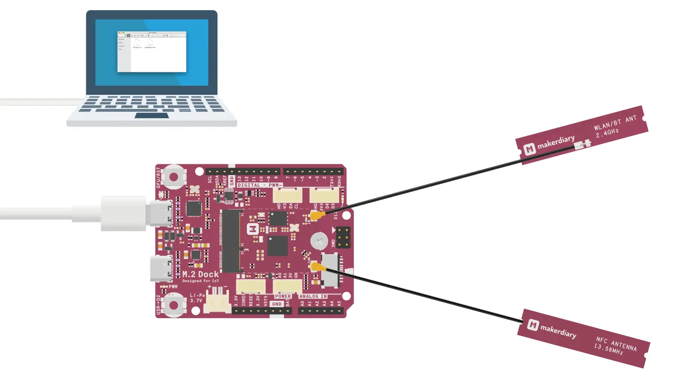

# Debugging with Arm Keil MDK

## Introduction

[Arm Keil MDK](http://www.keil.com/mdk5) is the complete software development environment for a wide range of Arm Cortex-M based microcontroller devices. MDK includes the µVision IDE and debugger, Arm C/C++ compiler, and essential middleware components. It supports all silicon vendors with more than 6,000 devices and is easy to learn and use.

This guide explains how to configure the local debug toolchain using M.2 Dock with Arm Keil MDK.

!!! note
	Due to the linker limits, this does not work in the free version of uVision. If you do not have a uVision license, you can use [Eclipse](eclipse.md) or [Visual Studio Code](vscode.md) instead.

## What you'll need

* A [nRF52840 M.2 Developer Kit](https://store.makerdiary.com/products/nrf52840-m2-developer-kit) (including nRF52840 M.2 Module and M.2 Dock)
* [ARM Keil MDK](http://www.keil.com/mdk5)

## Connecting the target

1. Mount the nRF52840 M.2 Module
2. Connect the **Debugger USB port** of M.2 Dock to your PC using the provided USB-C Cable
3. A disk drive called **M2-DOCK** will be automatically detected by the computer.

## Configuring the debugger

1. Open your Keil MDK project.
2. Go to *Project* -> *Options for Target* -> *Debug*, and select *CMSIS-DAP Debugger* from the drop-down menu.
	
	

3. Click *Settings* button. In the next windows select the *DAPLink CMSIS-DAP* adapter. Set the *SW* mode. In the *SW Device*, you can view the target device.
	
	

4. Click *OK* to save the options.

## Debugging your project

1. Insert a Breakpoint in your code. 
2. Click the menu *Debug* -> *Start/Stop Debug Session*, and debugging starts. 
3. Now you can explore the debugging capabilities for Variables, Registers and more.

## Create an Issue

Interested in contributing to this project? Want to report a bug? Feel free to click here:

<a href="https://github.com/makerdiary/m2-dock/issues/new?title=Keil%20Debugging:%20%3Ctitle%3E"><button class="md-tile md-tile--primary"><svg xmlns="http://www.w3.org/2000/svg" viewBox="0 0 14 16" width="14" height="16"><path fill-rule="evenodd" d="M7 2.3c3.14 0 5.7 2.56 5.7 5.7s-2.56 5.7-5.7 5.7A5.71 5.71 0 011.3 8c0-3.14 2.56-5.7 5.7-5.7zM7 1C3.14 1 0 4.14 0 8s3.14 7 7 7 7-3.14 7-7-3.14-7-7-7zm1 3H6v5h2V4zm0 6H6v2h2v-2z"></path></svg> Create an Issue</button></a>