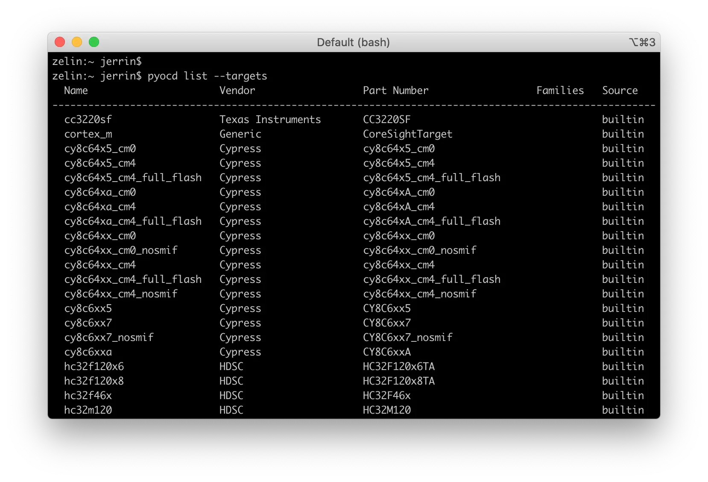
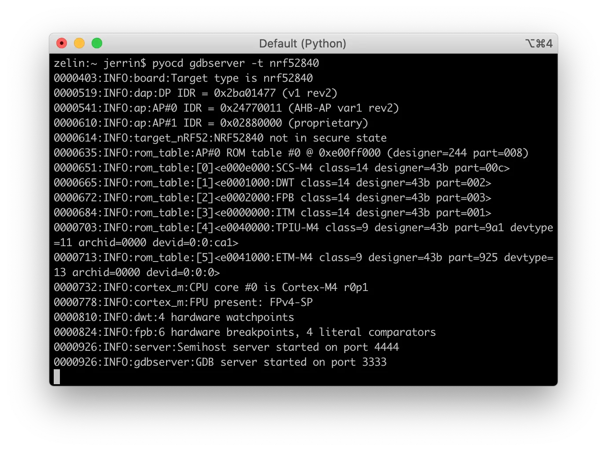

# Debugging with pyOCD

## Overview

[pyOCD](https://github.com/mbedmicro/pyOCD) is an open source Python package for programming and debugging Arm Cortex-M microcontrollers using multiple supported types of USB debug probes. It is fully cross-platform, with support for Linux, macOS, and Windows.

A command line tool is provided that covers most use cases, or you can make use of the Python API to enable low-level target control. A common use for the Python API is to run and control CI tests.

Upwards of 70 popular MCUs are supported built-in. In addition, through the use of CMSIS-Packs, nearly every Cortex-M device on the market is supported.

This guide demonstrates the basic usage of pyOCD with M.2 Dock. For more detailed information, refer to the [pyOCD GitHub repository](https://github.com/mbedmicro/pyOCD).

## What you'll need

* A [nRF52840 M.2 Developer Kit](https://store.makerdiary.com/products/nrf52840-m2-developer-kit) (including nRF52840 M.2 Module and M.2 Dock)
* A macOS, Linux or Windows computer

## Installing

The latest stable version of pyOCD may be installed via [pip](https://pip.pypa.io/en/stable/index.html) as follows:

``` sh
pip install -U pyocd
```

Alternatively, to install the latest prerelease version from the HEAD of the master branch, you can do the following:

``` sh
pip install --pre -U https://github.com/mbedmicro/pyOCD/archive/master.zip
```

## Basic Usage

The `pyocd` command line tool gives you total control over your target with these subcommands:

* `gdbserver`: GDB remote server allows you to debug using gdb via either [GNU MCU Eclipse plug-in](https://gnu-mcu-eclipse.github.io/) or the console.
* `flash`: Program files of various formats into flash memory.
* `erase`: Erase part or all of an MCU's flash memory.
* `pack`: Manage [CMSIS Device Family Packs](http://arm-software.github.io/CMSIS_5/Pack/html/index.html) that provide additional target device support.
* `commander`: Interactive REPL control and inspection of the MCU.
* `list`: Show connected devices.

## Target support

When pyOCD connects to a target, it needs to know what type of target it is controlling. To see the available target types you can run:

``` sh
pyocd list --targets
```



## Debugging

pyOCD contains a GDB remote server which allows you to debug using gdb. You can get additional help by running: `pyocd gdbserver --help`.

You will be able to execute the following in order to start a GDB server:

``` sh
pyocd gdbserver -t nrf52840
```



In the second terminal window, connect to the GDB server and load firmware by running:

``` sh
$ arm-none-eabi-gdb application.elf

<gdb> target remote localhost:3333
<gdb> load
<gdb> monitor reset
```

The GDB server also works well with [Eclipse](https://www.eclipse.org/) and the [GNU MCU Eclipse plug-ins](https://gnu-mcu-eclipse.github.io/). GNU MCU Eclipse fully supports pyOCD with an included pyOCD debugging plugin.

For instructions on GNU MCU Eclipse for pyOCD, please refer to:

* [Debugging with Eclipse](eclipse.md)

## Create an Issue

Interested in contributing to this project? Want to report a bug? Feel free to click here:

<a href="https://github.com/makerdiary/m2-dock/issues/new?title=pyOCD%20Debugging:%20%3Ctitle%3E"><button class="md-tile md-tile--primary"><svg xmlns="http://www.w3.org/2000/svg" viewBox="0 0 14 16" width="14" height="16"><path fill-rule="evenodd" d="M7 2.3c3.14 0 5.7 2.56 5.7 5.7s-2.56 5.7-5.7 5.7A5.71 5.71 0 011.3 8c0-3.14 2.56-5.7 5.7-5.7zM7 1C3.14 1 0 4.14 0 8s3.14 7 7 7 7-3.14 7-7-3.14-7-7-7zm1 3H6v5h2V4zm0 6H6v2h2v-2z"></path></svg> Create an Issue</button></a>