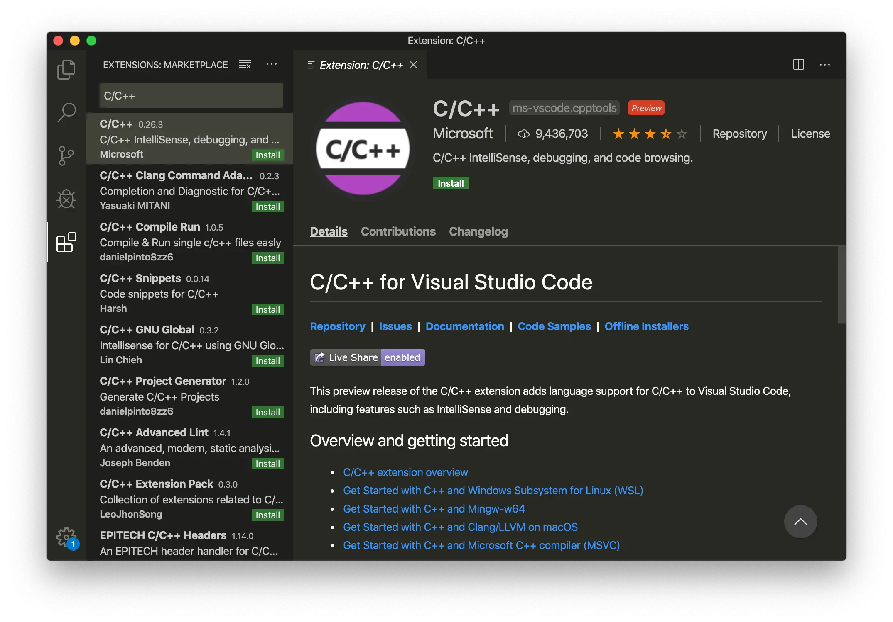
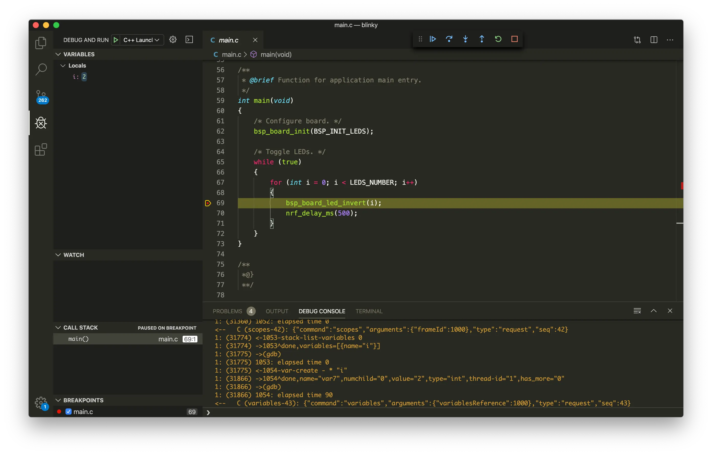

# Debugging with Visual Studio Code

## Introduction

This guide explains how to configure the local debug toolchain using M.2 Dock with Visual Studio Code.

## What you'll need

* A [nRF52840 M.2 Developer Kit](https://store.makerdiary.com/products/nrf52840-m2-developer-kit) (including nRF52840 M.2 Module and M.2 Dock)
* A macOS, Linux or Windows computer

## Install Visual Studio Code

You need to install Visual Studio Code with the C/C++ extensions to begin.

1. Install [Visual Studio Code](https://code.visualstudio.com/).

2. Open Visual Studio Code, and click on the <kbd>Extensions</kbd> button.

3. Search for the C/C++ plugin (by Microsoft) and click <kbd>Install</kbd>.

4. When prompted, restart the IDE.



## Install pyOCD

The latest stable version of pyOCD may be installed via [pip](https://pip.pypa.io/en/stable/index.html) as follows. **Skip** this step if pyOCD already exists.

``` sh
pip install -U pyocd
```

## Install GNU Arm Embedded Toolchain

Download and install the [GNU ARM Embedded Toolchain](https://developer.arm.com/open-source/gnu-toolchain/gnu-rm/downloads). Then ensure the path is added to your OS PATH environment variable, for example on macOS:

``` sh
echo 'export PATH="<path to install directory>/gcc-arm-none-eabi-7-2018-q2-update/bin:${PATH}"' >> ~/.bash_profile
source ~/.bash_profile
```

Type the following in your terminal to verify if `arm-none-eabi-gcc` works:

``` sh
arm-none-eabi-gcc --version
```

## Configuring the debugger

The `launch.json` file is used to configure the debugger in Visual Studio Code. Perform the following steps to configure the debugger for your project:

1. Open the project folder in Visual Studio Code.

2. Open the `.vscode/launch.json` file and add the example configurations:

	``` json
	{
	    "version": "0.2.0",
	    "configurations": [
	        {
	            "name": "C++ Launch",
	            "type": "cppdbg",
	            "request": "launch",
	            "program": "${workspaceRoot}/armgcc/_build/nrf52840_xxaa.out",
	            "args": [],
	            "stopAtEntry": true,
	            "cwd": "${workspaceRoot}",
	            "environment": [],
	            "externalConsole": false,
	            "debugServerArgs": "",
	            "serverLaunchTimeout": 20000,
	            "filterStderr": true,
	            "filterStdout": false,
	            "serverStarted": "GDB\\ server\\ started",
	            "preLaunchTask": "make",
	            "setupCommands": [
	                { "text": "-target-select remote localhost:3333", "description": "connect to target", "ignoreFailures": false },
	                { "text": "-file-exec-and-symbols ${workspaceRoot}/armgcc/_build/nrf52840_xxaa.out", "description": "load file", "ignoreFailures": false},
	                { "text": "-interpreter-exec console \"monitor endian little\"", "ignoreFailures": false },
	                { "text": "-interpreter-exec console \"monitor reset\"", "ignoreFailures": false },
	                { "text": "-interpreter-exec console \"monitor halt\"", "ignoreFailures": false },
	                { "text": "-interpreter-exec console \"monitor arm semihosting enable\"", "ignoreFailures": false },
	                { "text": "-target-download", "description": "flash target", "ignoreFailures": false }
	            ],
	            "logging": {
	                "moduleLoad": true,
	                "trace": true,
	                "engineLogging": true,
	                "programOutput": true,
	                "exceptions": true
	            },
	            "linux": {
	                "MIMode": "gdb",
	                "MIDebuggerPath": "arm-none-eabi-gdb",
	                "debugServerPath": "pyocd-gdbserver"
	            },
	            "osx": {
	                "MIMode": "gdb",
	                "MIDebuggerPath": "arm-none-eabi-gdb",
	                "debugServerPath": "pyocd-gdbserver"
	            },
	            "windows": {
	                "preLaunchTask": "make.exe",
	                "MIMode": "gdb",
	                "MIDebuggerPath": "arm-none-eabi-gdb.exe",
	                "debugServerPath": "pyocd-gdbserver.exe",
	                "setupCommands": [
	                    { "text": "-environment-cd ${workspaceRoot}\\armgcc\\_build" },
	                    { "text": "-target-select remote localhost:3333", "description": "connect to target", "ignoreFailures": false },
	                    { "text": "-file-exec-and-symbols nrf52840_xxaa.out", "description": "load file", "ignoreFailures": false},
	                    { "text": "-interpreter-exec console \"monitor endian little\"", "ignoreFailures": false },
	                    { "text": "-interpreter-exec console \"monitor reset\"", "ignoreFailures": false },
	                    { "text": "-interpreter-exec console \"monitor halt\"", "ignoreFailures": false },
	                    { "text": "-interpreter-exec console \"monitor arm semihosting enable\"", "ignoreFailures": false },
	                    { "text": "-target-download", "description": "flash target", "ignoreFailures": false }
	                ]
	            }
	        }
	    ]
	}
	```

3. Create a `make` task in `.vscode/tasks.json` file:
	``` json
	{
	    // See https://go.microsoft.com/fwlink/?LinkId=733558
	    // for the documentation about the tasks.json format
	    "version": "2.0.0",
	    "tasks": [
	        {
	            "label": "make",
	            "options": {
	                "cwd": "${workspaceRoot}/armgcc"
	            },
	            "problemMatcher": {
	                "owner": "cpp",
	                "fileLocation": ["relative", "${workspaceRoot}"],
	                "pattern": {
	                    "regexp": "^(.*):(\\d+):(\\d+):\\s+(warning|error):\\s+(.*)$",
	                    "file": 1,
	                    "line": 2,
	                    "column": 3,
	                    "severity": 4,
	                    "message": 5
	                }
	            },
	            "args": [],
	            "linux": {
	                "command": "make"
	            },
	            "osx": {
	                "command": "make"
	            },
	            "windows": {
	                "command": "make.exe"
	            }
	        }
	    ]
	}
	```

## Connecting the target

1. Mount the nRF52840 M.2 Module
2. Connect the **Debugger USB port** of M.2 Dock to your PC using the provided USB-C Cable
3. A disk drive called **M2-DOCK** will be automatically detected by the computer.


## Debugging your project

Click the menu <kbd>Debug</kbd> -> <kbd>Start Debugging</kbd>, and debugging starts. Click on the <kbd>DEBUG CONSOLE</kbd> tab to see the debug output:

[](assets/images/vscode-debugging.webp)

Now you can explore the debugging capabilities for Variables, Breakpoints and more.

## Reference
* [VS Code Launch Json Reference](https://code.visualstudio.com/docs/cpp/launch-json-reference)
* [VS Code Tasks Documentation](https://code.visualstudio.com/docs/editor/tasks)

## Create an Issue

Interested in contributing to this project? Want to report a bug? Feel free to click here:

<a href="https://github.com/makerdiary/m2-dock/issues/new?title=VS%20Code%20Debugging:%20%3Ctitle%3E"><button class="md-tile md-tile--primary"><svg xmlns="http://www.w3.org/2000/svg" viewBox="0 0 14 16" width="14" height="16"><path fill-rule="evenodd" d="M7 2.3c3.14 0 5.7 2.56 5.7 5.7s-2.56 5.7-5.7 5.7A5.71 5.71 0 011.3 8c0-3.14 2.56-5.7 5.7-5.7zM7 1C3.14 1 0 4.14 0 8s3.14 7 7 7 7-3.14 7-7-3.14-7-7-7zm1 3H6v5h2V4zm0 6H6v2h2v-2z"></path></svg> Create an Issue</button></a>