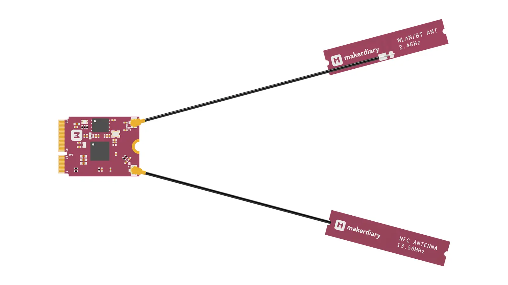
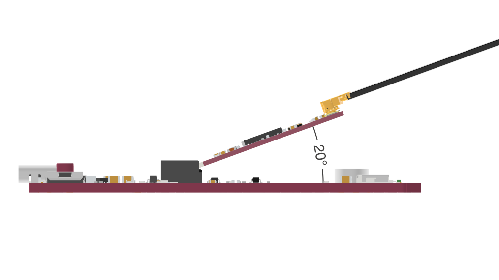
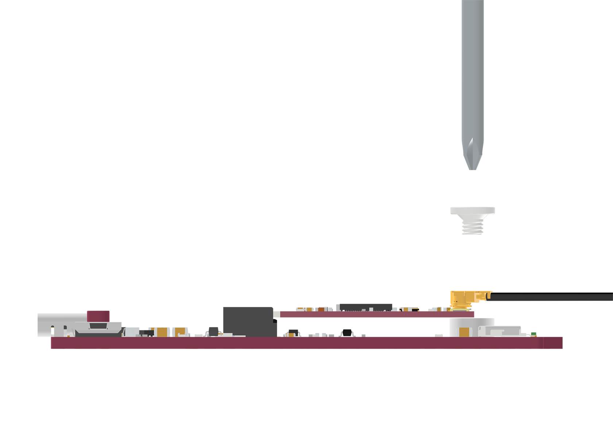
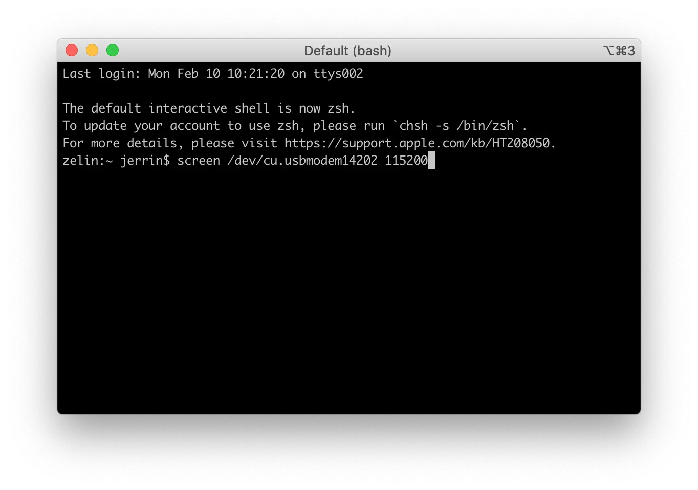
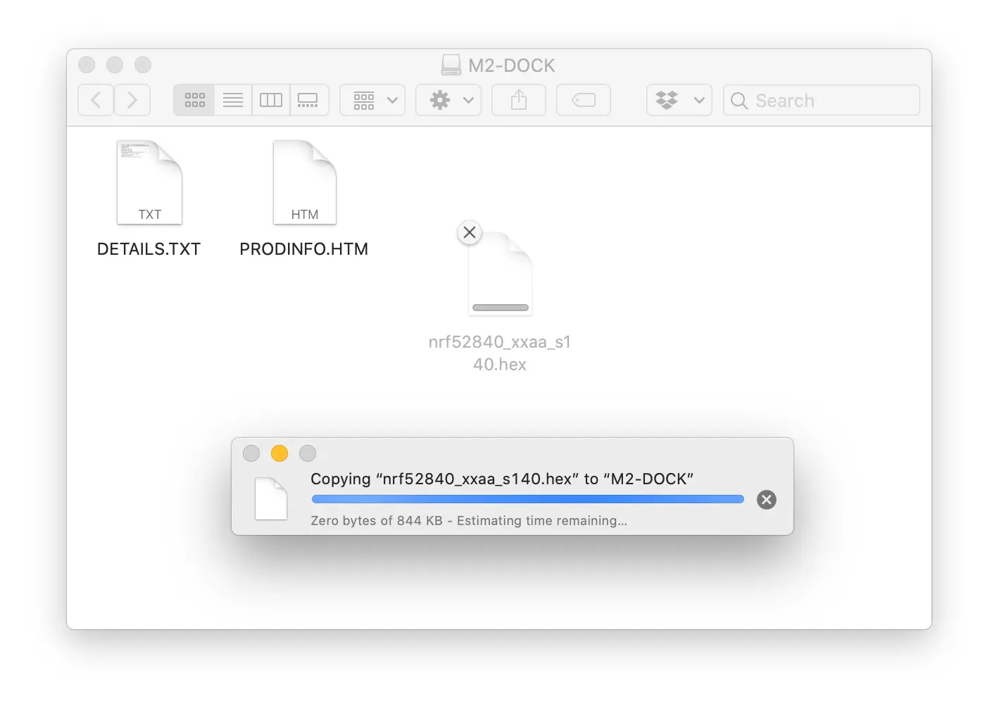

# Getting Started with M.2 Dock

## Introduction

This guide is intended to assist users in the initial setup and demonstration of the basic usage with M.2 Dock:

* [Logging via Serial port](#logging-via-serial-port)
* [Drag-n-Drop Programming](#drag-n-drop-programming)
* [Using pyOCD Command Tool](#using-pyocd-command-tool)

## What you'll need

* A [nRF52840 M.2 Developer Kit](https://store.makerdiary.com/products/nrf52840-m2-developer-kit) (including nRF52840 M.2 Module and M.2 Dock)
* A macOS, Linux or Windows computer

## Assemble the hardware

1. Make sure the M.2 Dock is powered off

2. Attach the provided 2.4GHz and NFC cabled PCB antennas to the nRF52840 M.2 module as shown in the figure below:

	

3. Insert the module into the connector as shown in the figure below:

	!!! Warning "Angle of Insertion"
		Angled insertion is allowable and preferred to minimize the insertion force. The angle of insertion is **5° ~ 25°**, **typically 20°**.
	
	

4. Secure the module using the provided mounting screw as shown in the figure below:

	


## Connect the board

1. Mount the nRF52840 M.2 Module
2. Connect the **Debugger USB port** of M.2 Dock to your PC using the provided USB-C Cable
3. A disk drive called **M2-DOCK** will be automatically detected by the computer.


## Logging via Serial port

M.2 Dock enables developers with a Virtual COM Port which you can use for logging and reporting application state.

There are many Terminal applications available for your host PC. They provide a window where your target can print messages. Select the tool according to your host:

* [screen](https://www.gnu.org/software/screen/manual/screen.html) (for macOS/Linux)
* [PuTTY](https://www.chiark.greenend.org.uk/~sgtatham/putty/) (for Windows)
* [CoolTerm](http://freeware.the-meiers.org/) (for macOS/Linux/Windows)



## Drag-n-Drop Programming

Drag-n-Drop is an optional intuitive programming feature. It allows programming of your target MCU in a very simple way: dragging and dropping a file (`.hex`-format) onto the **M2-DOCK** drive.

There is no need to install application software. Anyone that can drag and drop a file to a USB memory stick can now program the target module.



!!! tip
	Upon completion, the drive remounts. If a failure occurs, the file `FAIL.TXT` appears on the drive containing information about the failure.

## Using pyOCD Command Tool

[pyOCD](https://github.com/mbedmicro/pyOCD) is an open source Python package for programming and debugging Arm Cortex-M microcontrollers using the DAPLink debugger. It is fully cross-platform, with support for Linux, macOS, and Windows.

The latest stable version of pyOCD can be installed via [pip](https://pip.pypa.io/en/stable/index.html) as follows. **Skip** the installation if pyOCD already exists.

``` sh
pip install -U pyocd
```

List information about the debugger connected to your computer by running:

``` sh
pyocd list
```

The output should be similar as below:

``` sh
  #   Probe                   Unique ID
--------------------------------------------------------------------------------
  0   ARM DAPLink CMSIS-DAP   10283602185129a100000000000000000000000097969902
```

The following commands demonstrate how to flash/erase the nRF52840 M.2 Module:

* To erase the whole flash of the nRF52840 target:

	``` sh
	pyocd erase -t nrf52840 --chip
	```

* To flash the nRF52840 target with `.hex`-format firmware:

	``` sh
	pyocd flash -t nrf52840 Sample.hex
	```

* To flash the nRF52840 target with a plain binary:

	``` sh
	pyocd flash -t nrf52840 --base-address 0x1000 Sample.bin
	```
	The `--base-address` option is used for setting the address where to flash a binary. Defaults to start of flash.

!!! tip
	Run `pyocd --hlep` to get the available commands and additional help.

## Explore Further

Now that you are familiar with the M.2 Dock, it's time to explore more tutorials available below:

* [Getting Started with Power Profiling](power-profiling.md)
* [Debugging with pyOCD](debugging/pyocd.md)
* [Debugging with Visual Studio Code](debugging/vscode.md)
* [Debugging with Eclipse](debugging/eclipse.md)
* [Debugging with Keil MDK](debugging/keil-mdk.md)
* [Debugging with IAR Workbench](debugging/iar-ewarm.md)
* [Upgrading the DAPLink Firmware](upgrading.md)

We also offer the **[nRF52840 M.2 Developer Kit](https://store.makerdiary.com/products/nrf52840-m2-developer-kit)** to help you prototype your application and then scale to production faster using the nRF52840 M.2 Module combined with your custom PCB hardware.

<a href="https://wiki.makerdiary.com/nrf52840-m2-devkit" target="_blank"><button class="md-tile md-tile--primary" style="width:auto;"><svg xmlns="http://www.w3.org/2000/svg" viewBox="0 0 16 16" width="16" height="16"><path fill-rule="evenodd" d="M12.17 3.83c-.27-.27-.47-.55-.63-.88-.16-.31-.27-.66-.34-1.02-.58.33-1.16.7-1.73 1.13-.58.44-1.14.94-1.69 1.48-.7.7-1.33 1.81-1.78 2.45H3L0 10h3l2-2c-.34.77-1.02 2.98-1 3l1 1c.02.02 2.23-.64 3-1l-2 2v3l3-3v-3c.64-.45 1.75-1.09 2.45-1.78.55-.55 1.05-1.13 1.47-1.7.44-.58.81-1.16 1.14-1.72-.36-.08-.7-.19-1.03-.34a3.39 3.39 0 01-.86-.63zM16 0s-.09.38-.3 1.06c-.2.7-.55 1.58-1.06 2.66-.7-.08-1.27-.33-1.66-.72-.39-.39-.63-.94-.7-1.64C13.36.84 14.23.48 14.92.28 15.62.08 16 0 16 0z"></path></svg> nRF52840 M.2 Developer Kit</button></a>

## Create an Issue

Interested in contributing to this project? Want to report a bug? Feel free to click here:

<a href="https://github.com/makerdiary/m2-dock/issues/new?title=Getting%20Started:%20%3Ctitle%3E"><button class="md-tile md-tile--primary"><svg xmlns="http://www.w3.org/2000/svg" viewBox="0 0 14 16" width="14" height="16"><path fill-rule="evenodd" d="M7 2.3c3.14 0 5.7 2.56 5.7 5.7s-2.56 5.7-5.7 5.7A5.71 5.71 0 011.3 8c0-3.14 2.56-5.7 5.7-5.7zM7 1C3.14 1 0 4.14 0 8s3.14 7 7 7 7-3.14 7-7-3.14-7-7-7zm1 3H6v5h2V4zm0 6H6v2h2v-2z"></path></svg> Create an Issue</button></a>
