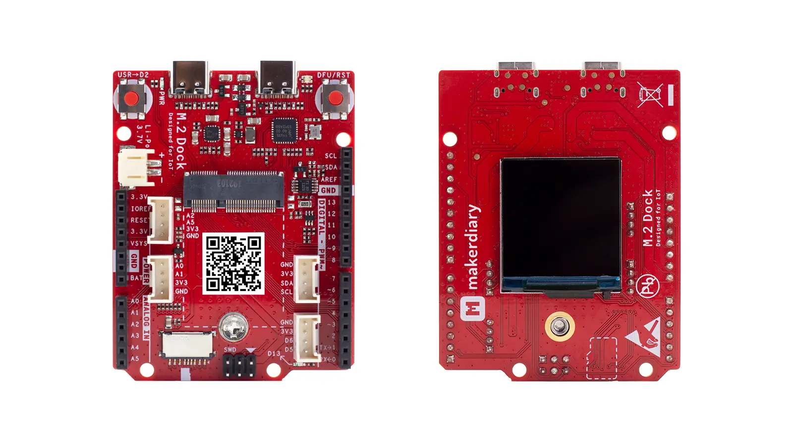

# M.2 Dock <small>An essential carrier board to quickly prototype your next embedded design with a removable M.2 module.</small>

## Description

The M.2 Dock is an essential carrier board to quickly prototype your next embedded design with a removable M.2 module. It features a fully-integrated [DAPLink](https://armmbed.github.io/DAPLink/) debugger with [Power Profiling](power-profiling.md), enabling you to program, debug and perform real-time current profiling of your IoT applications without using external tools.

This design extends the interfaces compared to the M.2 Module through an M.2 E-Key connector, including USB 2.0 ports, UART, SPI, TWI, PDM, I2S, PWM, ADC and GPIOs.

The M.2 Dock also comes with 1.3" 240x240 Color IPS TFT LCD, Li-Po Battery Charger, microSD Card Slot, Grove Connectors, LEDs and Buttons.

## Key Features

* Integrated DAPLink Debugger
	- MSC - drag-n-drop programming flash memory
	- CDC - virtual com port for log, trace and terminal emulation
	- HID/WEBUSB HID - CMSIS-DAP compliant debug channel

* Advanced Power Profiling
	- Up to 690 mA current measurement
	- Voltage tracking
	- 30000 samples per second
	- Precision amplifiers with dual gain stage
	- Cross-platform utility available in Python

* M.2 E-Key connector
* 1.3" 240x240 Color IPS TFT LCD Display
* Li-Po Battery Charger with Power Path Management
* User programmable LED and Button
* microSD Card Slot
* 4 Grove Connectors
* Reversible USB-C Connectors
* Arduino Form Factor
* 3.3V IO Operationg Voltage

## Hardware Diagram

The hardware diagram of the M.2 Dock is shown below:

## Supported Modules

The following shows the M.2 module that can work with M.2 Dock. More modules are planned and will show up gradually over time.

* [nRF52840 M.2 Module](https://store.makerdiary.com/products/nrf52840-m2-module)

## Tutorials

We think the best way to learn is by doing. And to help you get started, we have provided a series of tutorials. Find the details below:

* [Getting Started with M.2 Dock](getting-started.md)
* [Getting Started with Power Profiling](power-profiling.md)
* [Debugging with pyOCD](debugging/pyocd.md)
* [Debugging with Visual Studio Code](debugging/vscode.md)
* [Debugging with Eclipse](debugging/eclipse.md)
* [Debugging with Keil MDK](debugging/keil-mdk.md)
* [Debugging with IAR Workbench](debugging/iar-ewarm.md)
* [Upgrading the DAPLink Firmware](upgrading.md)

We also offer the **[nRF52840 M.2 Developer Kit](https://store.makerdiary.com/products/nrf52840-m2-developer-kit)** to help you prototype your application and then scale to production faster using the nRF52840 M.2 Module combined with your custom PCB hardware.

<a href="https://wiki.makerdiary.com/nrf52840-m2-devkit" target="_blank"><button class="md-tile md-tile--primary" style="width:auto;"><svg xmlns="http://www.w3.org/2000/svg" viewBox="0 0 16 16" width="16" height="16"><path fill-rule="evenodd" d="M12.17 3.83c-.27-.27-.47-.55-.63-.88-.16-.31-.27-.66-.34-1.02-.58.33-1.16.7-1.73 1.13-.58.44-1.14.94-1.69 1.48-.7.7-1.33 1.81-1.78 2.45H3L0 10h3l2-2c-.34.77-1.02 2.98-1 3l1 1c.02.02 2.23-.64 3-1l-2 2v3l3-3v-3c.64-.45 1.75-1.09 2.45-1.78.55-.55 1.05-1.13 1.47-1.7.44-.58.81-1.16 1.14-1.72-.36-.08-.7-.19-1.03-.34a3.39 3.39 0 01-.86-.63zM16 0s-.09.38-.3 1.06c-.2.7-.55 1.58-1.06 2.66-.7-.08-1.27-.33-1.66-.72-.39-.39-.63-.94-.7-1.64C13.36.84 14.23.48 14.92.28 15.62.08 16 0 16 0z"></path></svg> nRF52840 M.2 Developer Kit</button></a>

## Design Resource

|    **Title**                | **Version** |
| --------------------------- | ----------- |
| [M.2 Dock Hardware Diagram](https://wiki.makerdiary.com/m2-dock/resources/m2_dock_hw_diagram_v1_0.pdf) | V1.0 |
| [M.2 Dock Schematic for nRF52840 M.2 Module](https://wiki.makerdiary.com/m2-dock/resources/m2_dock_schematic_v1_0_for_nrf52840.pdf) | V1.0 |
| [M.2 Dock Board File](https://wiki.makerdiary.com/m2-dock/resources/m2_dock_board_file_v1_0.pdf) | V1.0 |
[M.2 Dock 3D Model](https://wiki.makerdiary.com/m2-dock/resources/m2_dock_3d_model_v1_0.step) | V1.0 |

## Create an Issue
Interested in contributing to this project? Want to report a bug? Feel free to click here:

<a href="https://github.com/makerdiary/m2-dock/issues/new"><button class="md-tile md-tile--primary"><svg xmlns="http://www.w3.org/2000/svg" viewBox="0 0 14 16" width="14" height="16"><path fill-rule="evenodd" d="M7 2.3c3.14 0 5.7 2.56 5.7 5.7s-2.56 5.7-5.7 5.7A5.71 5.71 0 011.3 8c0-3.14 2.56-5.7 5.7-5.7zM7 1C3.14 1 0 4.14 0 8s3.14 7 7 7 7-3.14 7-7-3.14-7-7-7zm1 3H6v5h2V4zm0 6H6v2h2v-2z"></path></svg> Create an Issue</button></a>
