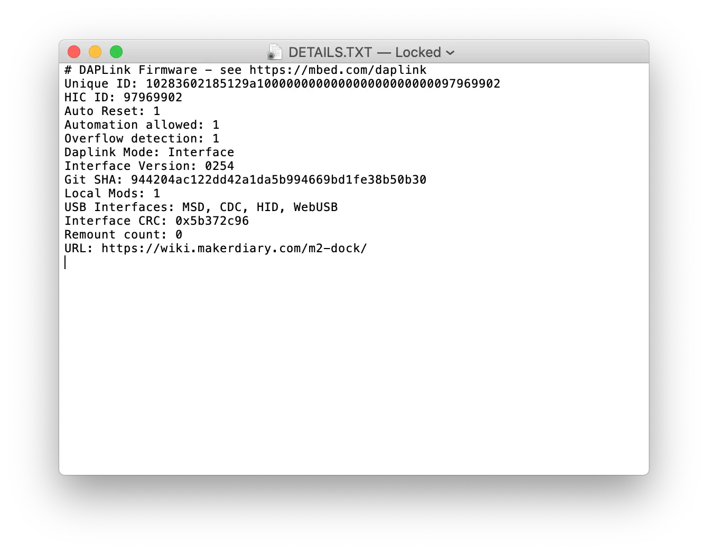

# Upgrading the DAPLink Firmware

## Introduction

M.2 Dock can be easily upgraded via the on-chip bootloader software over USB. An update ensures you have the most recent features and improvements for your current version of DAPLink firmware. 

This section describes how to upgrade to the latest DAPLink firmware.

## What you'll need

* M.2 Dock
* macOS, Linux, or Windows 7 or newer
* 1x USB-C Cable

## Prepare the firmware

The current release DAPLink firmware is hosted on [GitHub Release Site](https://github.com/makerdiary/m2-dock/releases) with the name `m2_dock_<target>_<version>.bin`.

<a href="https://github.com/makerdiary/m2-dock/releases"><button class="md-tile md-tile--primary" style="width:auto;"><svg xmlns="http://www.w3.org/2000/svg" viewBox="0 0 16 16" width="16" height="16"><path fill-rule="evenodd" d="M9 12h2l-3 3-3-3h2V7h2v5zm3-8c0-.44-.91-3-4.5-3C5.08 1 3 2.92 3 5 1.02 5 0 6.52 0 8c0 1.53 1 3 3 3h3V9.7H3C1.38 9.7 1.3 8.28 1.3 8c0-.17.05-1.7 1.7-1.7h1.3V5c0-1.39 1.56-2.7 3.2-2.7 2.55 0 3.13 1.55 3.2 1.8v1.2H12c.81 0 2.7.22 2.7 2.2 0 2.09-2.25 2.2-2.7 2.2h-2V11h2c2.08 0 4-1.16 4-3.5C16 5.06 14.08 4 12 4z"></path></svg> DAPLink Firmware</button></a>

## Update the firmware

To update the firmware, follow these steps:

1. Enter DFU mode by pressing **DFU/RST** button during connecting to the **Debugger USB port**. The board should mount as a disk drive called **CRP DISABLD**.
2. Open **CRP DISABLD**, and remove the file called `firmware.bin`.
3. Copy the new firmware (`.bin`-format file prepared above) onto **CRP DISABLD**:
	* On Windows, replace `firmware.bin` with the new firmware.
	* On Linux/macOS, use `dd` command:
		``` sh
		dd if={new_firmware.bin} of={firmware.bin} conv=notrunc
		```
4. Unplug your M.2 Dock, and plug it back in. It should now appear as a disk drive called **M.2 Dock**.


## Verify the update

Check the `DETAILS.TXT` file in **M.2 Dock** drive to verify the `Interface Version`.




## Create an Issue

Interested in contributing to this project? Want to report a bug? Feel free to click here:

<a href="https://github.com/makerdiary/m2-dock/issues/new?title=Upgrading%20DAPLink:%20%3Ctitle%3E"><button class="md-tile md-tile--primary"><svg xmlns="http://www.w3.org/2000/svg" viewBox="0 0 14 16" width="14" height="16"><path fill-rule="evenodd" d="M7 2.3c3.14 0 5.7 2.56 5.7 5.7s-2.56 5.7-5.7 5.7A5.71 5.71 0 011.3 8c0-3.14 2.56-5.7 5.7-5.7zM7 1C3.14 1 0 4.14 0 8s3.14 7 7 7 7-3.14 7-7-3.14-7-7-7zm1 3H6v5h2V4zm0 6H6v2h2v-2z"></path></svg> Create an Issue</button></a>
